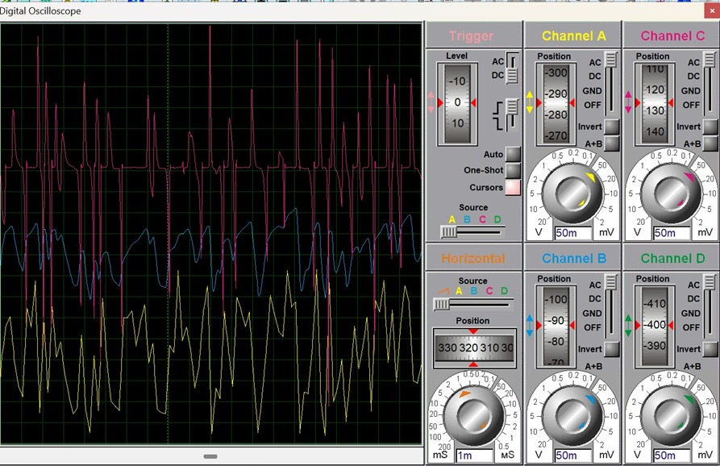

# Noise Mitigation & Multi-Stage Signal Recovery System
### BJT Amplifier with Cascaded RC Filtering | EE-313 Electronic Circuit Design

## Overview
A complete hardware signal recovery system designed to extract a weak 
audio signal from a broadband white noise environment. The system 
cascades passive noise filtering with multi-stage BJT amplification to 
deliver a clean, amplified output to a 5 kΩ speaker load.

## System Architecture
Three cascaded functional blocks:
1. **2nd-Order RC Low-Pass Filter** — suppresses noise above 4.65 kHz 
   at −40 dB/decade
2. **Common Emitter Amplifier (Q1, BC547)** — provides voltage gain of 
   ~255 V/V with Miller compensation
3. **Common Collector Buffer (Q2, BC547)** — impedance matches to 5 kΩ 
   load with unity gain

## Circuit Schematic
.jpeg)

## Simulation Results (Proteus Oscilloscope)

Channel A (Yellow) = Raw noisy input (~465 mV p-p)  
Channel B (Blue) = Filtered signal (~452 mV p-p)  
Channel D (Pink) = Clean amplified output (~389 mV p-p)

## Key Design Parameters
| Parameter | Value |
|-----------|-------|
| Filter Cut-off (per stage) | 7.23 kHz |
| 2nd-Order Combined fc | 4.65 kHz |
| Filter Roll-off Rate | −40 dB/decade |
| CE Stage Voltage Gain | −255.4 V/V |
| Overall System Gain | 48.1 dB |
| Lower −3 dB Frequency (fL) | 21.6 Hz |
| Upper −3 dB Frequency (fH) | 6.21 kHz (Miller pole) |
| System Bandwidth | 6,188 Hz |
| Miller Capacitance | 25.64 nF |
| Q1 Quiescent Current | 1.41 mA |
| Q1 Operating Point (VCE) | 3.96 V |

## SNR Improvement
| Stage | SNR |
|-------|-----|
| Input (noisy) | −11.2 dB |
| Output (clean) | +25.8 dB |
| **Total Improvement** | **+37 dB** |

## Tools Used
- Proteus Design Suite (schematic capture & simulation)
- BC547 NPN BJTs (CE amplifier + CC buffer)
- Passive RC network (2nd-order Butterworth-type filter)

## Repository Contents
| File | Description |
|------|-------------|
| `CEP_Report.pdf` | Full project report with calculations |
| `Simulation.zip` | Proteus simulation + noise files |
| `Schematic.png` | Circuit schematic |
| `Oscilloscope.png` | Oscilloscope traces from simulation |

## Context
Complex Engineering Problem (CEP) for EE-313: Electronic Circuit Design  
BE Mechatronics Engineering — NUST, 2026  
Supervised by: Dr. Zaki Uddin
